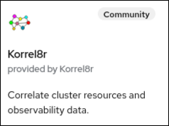

= Installing the operator
:copyright: This file is part of korrel8r, released under https://github.com/korrel8r/korrel8r/blob/main/LICENSE
:icons: font
// Metadata
:keywords: correlation, observability, resource, signal, kubernetes
:description: Correlation of observability signal data
// URLs
:github: https://github.com/korrel8r/
:project: {github}/operator#readme
:quay-operator: quay.io/korrel8r/operator
// abbreviations
:red-hat: Red{nbsp}Hat
:rh-ocp: {red-hat} OpenShift Container Platform
:rh-console: link:https://docs.openshift.com/container-platform/latest/web_console/web-console-overview.html[{rh-ocp} web console]
:logging: logging subsystem for {red-hat} OpenShift
:operator: Korrel8r Community Operator

== From latest release bundle
Install the https://sdk.operatorframework.io/docs/installation/[Operator SDK] tool.

[source,terminal,subs=attributes+]
----
kubectl create namespace korrel8r
operator-sdk -n korrel8r run bundle {quay-operator}-bundle:latest --security-context-config restricted
----

= From OperatorHub

There is a community operator for Korrel8r on OperatorHub.
It has been tested with {rh-ocp}, it may or may not work with other k8s clusters.

.Prerequisites

* You have administrator permissions on an {rh-ocp} cluster version 4.12 or newer.
* You have installed the https://docs.openshift.com/container-platform/latest/logging/cluster-logging-deploying.html[Red Hat OpenShift Logging Operator] version 5.8.1 or newer provided by {red-hat}.
* You have installed the https://docs.openshift.com/container-platform/latest/logging/log_storage/installing-log-storage.html#logging-loki-gui-install_installing-log-storage[Loki Operator] version 5.8.1 or newer provided by {red-hat}, and have created a `LokiStack` custom resource (CR).
* You have https://docs.openshift.com/container-platform/latest/logging/cluster-logging-deploying.html#configuring-log-storage-cr_cluster-logging-deploying[created a `ClusterLogging` CR] that configures LokiStack as the log store.

.Procedure

. In the {rh-console} go to `Home > Console > Operators > OperatorHub`
. Type "korrel8r" in the filter box and select the Korrel8r Community tile +
  
. Click Install, Install again, and you are done!
